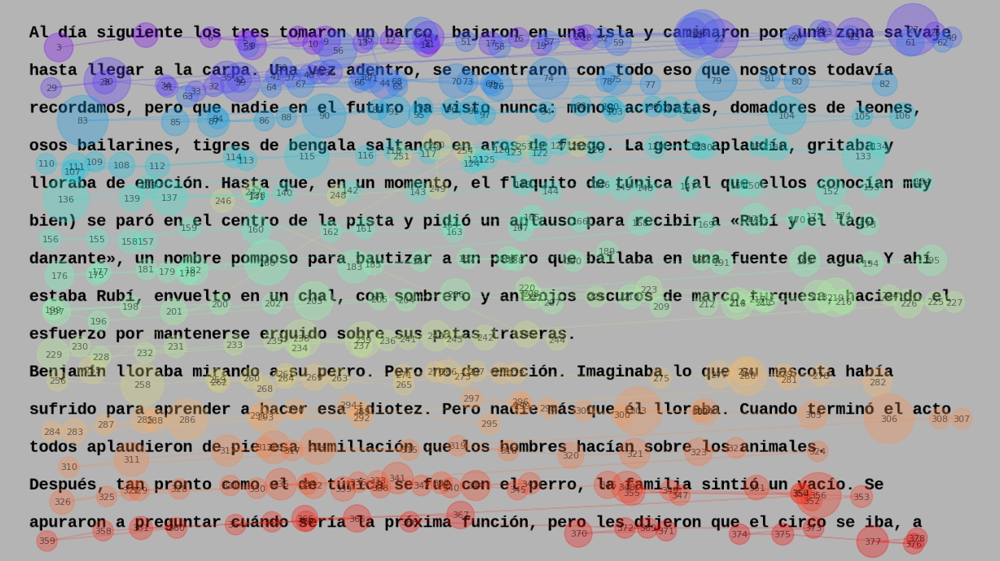

# Eye-tracking during natural reading

## About
The eyes are the only visible part of the brain. As such, they provide an easily accessible window into the cognitive processes that underpin attention. This has been acknowledged by neurolinguistic researchers for over a century now, with Javal’s initial observations concerning the role of eye movements in reading in 1879 (Huey, 1908). Nowadays, the fundamental assumption of the eyes as a window into the mind (Just & Carpenter, 1980) has long been validated, and the study of eye movements in reading has been established as a central tool for unraveling language processing in the brain (Kliegl et al., 2006).

The aim of this experiment is to obtain data on eye movements during reading in Spanish as spoken in Buenos Aires. Leveraging past findings, the recollected data will then be integrated into computational models of language.
## Definitions
A *word* is defined as a sequence of characters between two blank spaces, except those characters that correspond to punctuation signs.
 - *Unfrequent word*: its number of appearances in the latinamerican subtitles database from [EsPal](https://www.bcbl.eu/databases/espal/) is less or equal to 100.
 - *Short sentence*: less or equal to 5 words.
 - *Long sentence*: greater or equal to 30 words.
 - *Long word*: greater or equal to 10 chars.
 - *Unfrequent characters*: ¿; ?; ¡; !; “; ”; —; «; (; ).

## Corpus
The corpus is composed of 20 short stories (*items*), all written in Spanish as spoken in Buenos Aires. Most of them (15) were extracted from “100 covers de cuentos clásicos”, by Hernán Casciari. The original stories were written by several different authors and were subsequently simplified, translated (if needed) and re-written in Spanish by Casciari. This way, there is diversity in literary style, while maintaining both difficulty and slang constant.

On average, these are 800 (+/- 135) words long (min: 680; max: 1220) and each one takes 3 minutes to read (60 minutes total).
### Selection criteria
- Minimize dialogue.
- Minimize short and long sentences.
- Minimize unfrequent words and characters.
- Self-contained.
- No written dates.
- Not shorter than four hundred words.
- Not longer than two thousand words.

There is a correlation between *minimizing dialogues* and *minimizing unfrequent characters*, as dialogues are usually characterized by such.
## Methodology
* Stimuli creation (see ```Metadata/stimuli_config.mat```):
    * Resolution: 1080x1920.
    * Font: Courier New. Size: 24. Color: black.
    * Background color: grey.
    * Linespacing: 55px.
    * Max lines per screen: 14.
    * Max chars per line: 99.
    * Left margin: 280px.
    * Top margin: 185px.
* The participant is told that, after reading each text, he/she will be evaluated with three comprehensive questions.
* Their reading skills are also inquired.
* Items are ordered according to their number of unfrequent words and characters, and short and long sentences.
    * They are subsequently divided in four splits, and presented randomly within each split.
* Following this order, two sessions are made, each consisting of ten stories.
    * The stories in the first session have 769 words on average (+/- 37; min: 713; max: 843).
    * The stories in the second session have 822 words on average (+/- 183; min: 680; max: 1221).
* Once an item has been read, comprehension questions are answered.
* Additionally, unique common nouns are displayed (one by one) and the participant is asked to write the first word that comes to mind.
* The following item is displayed by pressing a button.
* Each item is a *block*. After each block, a one-minute break and eye-tracker calibration follows.
* Eye-tracker calibration is validated by the presentation of points positioned in the corners of where stimuli is displayed.

## Code
### Experiment
The experiment is coded in MATLAB 2015a using the Psychophysics Toolbox (http://psychtoolbox.org/). It is launched by running ```run_experiment.m```.
### Data processing
Data processing is carried out entirely in Python 3.10. There are four distinct steps:
1. **Data extraction:** Raw EDF data are converted to ASC using the *edf2asc* tool from the EyeLink Display Software.
2. **Data cleaning:** Trials are manually inspected, where horizontal lines are drawn for delimiting text lines and fixations are corrected when needed (```edit_trial.py```). Very short (50ms) and very long (1000ms) fixations are discarded in this step.
3. **Fixation assignment:** Fixations are assigned to words, using blank spaces as delimiters (```assign_fixations.py```). Return sweeps are discarded in this step.
4. **Measures extraction:** Eye-tracking measures (early, intermediate and late) are computed for each word, except the first and last words of each line or those following or preceding punctuation marks (```extract_measures.py```). The measures are:
    * **Early measures:** First fixation duration (FFD); single fixation duration (SFD); first pass reading time/gaze duration (FPRT); likelihood of skipping (LS).
    * **Intermediate measures:** Regression path duration (RPD); regression rate (RR).
    * **Late measures:** Total fixation duration (TFD); re-reading time (RRT); second pass reading time (SPRT); fixation count (FC); regression count (RC).
### Data analysis
Data analysis consists of printing overall stats per trial, plotting several early measures as a function of known effects (i.e., word length and frequency) and performing mixed effects models analysis with such fixed effects (```em_analysis.py```).
## Results
In this first iteration of the experiment, data from 14 participants were collected, where 7 of them completed the two sessions.

* [Reading skills effects](results/skills_on_measures.png)
* [Word length effects](results/word_length.png)
* [Word frequency effects](results/word_frequency.png)
* [First fixation duration and fixation count distributions](results/FFD_FC_distributions.png)